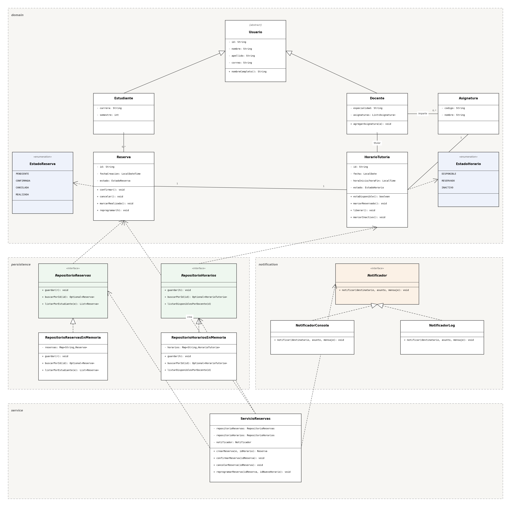

# Sistema de gestión de tutorías

Universidad Espíritu Santo · Diseño de Software (UCOM0310) · Actividad 5 | Ae1 — Diseño orientado a objetos de un sistema · Semana 2, PEL 4 - 2026

Proyecto: **Justin Arreaga**

## Propósito

Modelo orientado a objetos inicial del Sistema de gestión de tutorías académicas entre estudiantes y docentes, aplicando principios de orientación a objetos, modelado UML, cohesión y acoplamiento, y principios SOLID.

## Descripción del problema

La UEES requiere un sistema que permita a los docentes publicar horarios de tutoría disponibles, a los estudiantes consultar esos horarios y reservarlos, evitar que un mismo horario sea reservado por más de un estudiante, permitir cancelaciones y reprogramaciones, notificar a los usuarios ante cada cambio relevante, y mantener un registro consistente del estado de cada reserva — sin acoplar la lógica de negocio a una tecnología específica de persistencia o de notificación.

## Clases principales y responsabilidades

| Clase / interfaz | Paquete | Responsabilidad |
|---|---|---|
| `Usuario` (abstracta) | `domain` | Datos comunes de cualquier persona del sistema |
| `Estudiante`, `Docente` | `domain` | Especializaciones de `Usuario` |
| `Asignatura` | `domain` | Materia asociada a un horario de tutoría |
| `HorarioTutoria` | `domain` | Bloque de tutoría y su disponibilidad (protege su propio estado) |
| `Reserva` | `domain` | Ciclo de vida de una solicitud de tutoría (protege su propio estado) |
| `RepositorioReservas`, `RepositorioHorarios` | `persistence` | Contratos de persistencia (implementados en memoria en esta iteración) |
| `Notificador` | `notification` | Contrato de envío de notificaciones (`NotificadorConsola`, `NotificadorLog`) |
| `ServicioReservas` | `service` | Orquesta crear, confirmar, cancelar y reprogramar reservas |
| `App` | raíz | *Composition root*: arma las dependencias y ejecuta un flujo de demostración |

Detalle completo (atributos, comportamientos y colaboraciones) en [`docs/analisis.md`](docs/analisis.md).

## Decisiones de diseño relevantes

- Ninguna clase externa cambia el estado de `Reserva` o `HorarioTutoria` directamente: cada una protege sus propias transiciones válidas (por ejemplo, `Reserva.cancelar()` libera automáticamente el horario asociado).
- `ServicioReservas` no conoce implementaciones concretas de persistencia ni de notificación: las recibe por constructor a través de interfaces (`RepositorioReservas`, `RepositorioHorarios`, `Notificador`).
- La persistencia se implementó en memoria (`RepositorioReservasEnMemoria`, `RepositorioHorariosEnMemoria`) para esta primera iteración, pensada para sustituirse por una implementación real sin tocar la lógica de negocio.
- Se agregó una segunda implementación de `Notificador` (`NotificadorLog`) sin modificar `ServicioReservas`, como evidencia concreta de extensibilidad.

Justificación ampliada de cohesión y acoplamiento en [`docs/analisis.md`](docs/analisis.md).

## Principios SOLID aplicados

- **DIP** — `ServicioReservas` depende de `RepositorioReservas`, `RepositorioHorarios` y `Notificador` (interfaces), no de sus implementaciones.
- **SRP** — `HorarioTutoria` y `Reserva` tienen, cada una, una sola razón para cambiar.
- **OCP** — `NotificadorLog` se agregó sin modificar `ServicioReservas` ni `Notificador`.
- **ISP** — `RepositorioReservas` y `RepositorioHorarios` son interfaces separadas en lugar de un único contrato mezclado.

Justificación con evidencia técnica puntual en [`docs/analisis.md`](docs/analisis.md).

## Diagrama UML



Fuente editable: [`docs/modelo-clases.puml`](docs/modelo-clases.puml).

## Requisitos

- JDK 21
- Apache Maven 3.9.x

## Compilación y ejecución

```bash
mvn clean compile
mvn clean test
mvn compile exec:java -Dexec.mainClass="edu.uees.tutorias.App"
```

## Estructura del proyecto

```text
sistema-tutorias/
├── README.md
├── pom.xml
├── docs/
│   ├── analisis.md
│   ├── modelo-clases.puml
│   └── modelo-clases.png
└── src/
    ├── main/java/edu/uees/tutorias/
    │   ├── App.java
    │   ├── domain/
    │   ├── service/
    │   ├── persistence/
    │   └── notification/
    └── test/java/edu/uees/tutorias/service/
```

## Declaración de uso de inteligencia artificial

Me apoyé en el modelo Claude para agilizar la organización del caso de estudio, la generación preliminar del código en Java, el diseño de diagramas UML, la documentación en el README. Todo el código fue revisado, modificado e inspeccionado mediante ejecución y compilación (`javac`/JDK 26), garantizando el cumplimiento estricto de los requerimientos y asegurando mi total comprensión de las decisiones técnicas tomadas.
